# How to use AMS to enforce security and governance by encrypting IBM MQ messages on OpenShift

## Summary

### Scenario

You have an **IBM MQ queue manager**. An application is putting messages to a queue. Another application gets these messages from the queue.

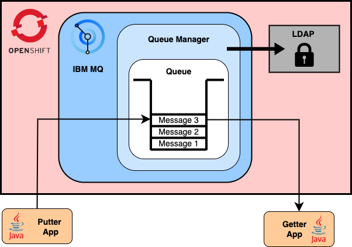

### Objectives

You want to **encrypt sensitive messages** in the queue such as those containing Personally Identifiable Information (PII) or financial transactions.

IBM MQ Administrators, such as engineers working on the system, should not be able to read these messages from the queue to enforce confidentiality and governance.

Applications authenticated as the sender (putter apps) must encrypt the messages before putting them in the queue, while applications authenticated as the receiver (getter app) are the only party able to retrieve and decrypt this information.

### Example

You have a messaging app that allows individuals to communicate with each other, using IBM MQ.

The following three personas will be used throughout this tutorial:
- **Alice**, the message sender
- **Bob**, the message receiver
- **James**, the IBM MQ Administrator

Alice can send a message containing PII to Bob that only he can read, which James cannot decrypt.

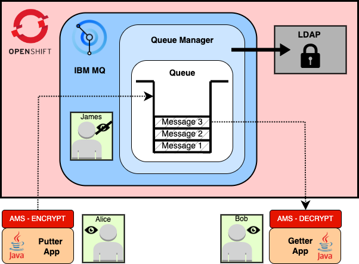

### Solution

**Advanced Messaging Security** (AMS) is an MQ feature which performs this encryption.

The authenticated sender (Alice) encrypts the messages before putting them in the queue. Only the authenticated receiver (Bob) is able to decrypt them upon reception.

AMS is then enforced by default to avoid human error. You cannot forget to encrypt a message.

## Pre-requisites 

- A Red Hat OpenShift cluster version 4.10 or later (required for IBM MQ operator v2.0.0 [[ref](https://www.ibm.com/docs/en/ibm-mq/9.3?topic=operator-version-support-mq)])
- On your local machine:
  - [OpenShift oc CLI](https://docs.openshift.com/container-platform/4.8/cli_reference/openshift_cli/getting-started-cli.html), logged into your cluster
  - Docker CLI (can be downloaded with [Docker Desktop](https://www.docker.com/products/docker-desktop/))
  - [Java](https://adoptopenjdk.net/) for compiling and running the applications
  - [Maven](https://maven.apache.org/download.cgi) for building the applications
  - A copy of the [mq-ams-tutorial](https://github.com/Theo-Reignier/mq-ams-tutorial) demo repository from Github

## Instructions

### 1 - Setup LDAP
**Install a development LDAP server that will manage user identities for the IBM MQ queue manager.**

In order to authenticate applications to MQ, LDAP is required when running in a container as system users can't be used. An install script for LDAP has been provided in the [01-install-ldap](./01-install-ldap/) directory.

```sh
./01-install-ldap/install.sh
```
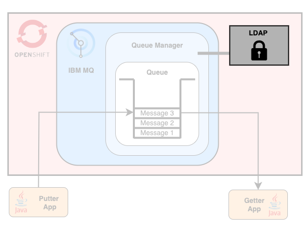

### 2 - Generate certificates
**Generate a new self-signed Certificate Authority (CA), and use it to create certificates for the MQ queue manager and the JMS MQ client apps.**

Certificates are used to secure the connection between the apps and the MQ Queue Manager. The queue manager will only accept connections from certified apps.

These certificates will be used locally by the apps and stored in OpenShift secrets to be used by MQ.

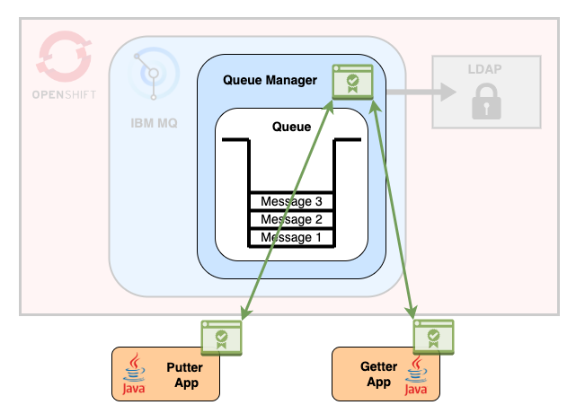

To generate certificates for MQ, update the variables at the top of the [generate.sh](./02-cert-generation/generate.sh) script before running it:
```sh
# Certificate information - Edit these variables to suit your project 
export ORGANISATION=acmeinc 
export COUNTRY=GB 
export LOCALITY=Hursley 
export STATE=Hampshire
```

```sh
./02-cert-generation/generate.sh
```

### 3 - Generate MQS keys
**Generate MQS keys to authenticate MQ users and enable encryption.**

Only one user is allowed to send and encrypt messages (Alice), while only one user is allowed to receive and decrypt messages (Bob).

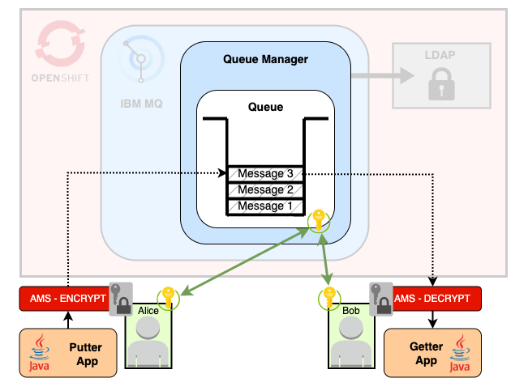

AMS makes use of MQS keys to:
- Authenticate the user performing the get/put action on the queue
- Encrypt messages with Alice's MQS key such that they can only be decrypted using Bob's MQS key

```sh
./03-mqs-keys/install-keys.sh
```

### 4 - Setup IBM MQ on OpenShift
**Create and configure a queue managerwith AMS using IBM MQ OpenShift operator.**

In order to deploy the IBM MQ operator on Red Hat OpenShift and deploy a Queue Manager with AMS, follow the steps below.

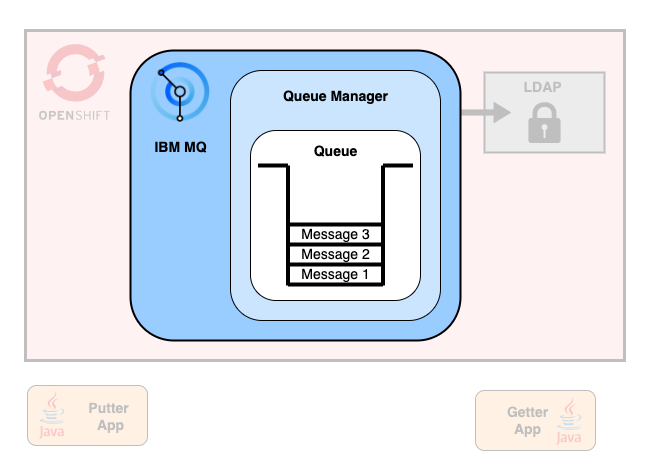

This tutorial assumes that you will be following the instructions on an OpenShift cluster where the MQ operator has not already been installed. Please read the instructions carefully if you already have a version of the operator installed.

1. To deploy the IBM MQ operator v2.0.0 on your cluster, run the [deploy-operator.sh](04-openshift/deploy-operator.sh) script.
**Warning:** Please note that if you already have an existing MQ Operator on your cluster, this script may introduce errors. If you do not want to run the script, you can install the IBM MQ operator manually by running `oc apply -f 04-openshift/resources/catalogsource.yaml` and going into the *OperatorHub* in the OpenShift web console. Make sure you install **version 2.0.0 or later**.
```sh
./04-openshift/deploy-operator.sh
```

2. To set an `IBM_ENTITLEMENT_KEY` environment variable, get your key from the [IBM Container Library](https://myibm.ibm.com/products-services/containerlibrary) and run 
```sh
export IBM_ENTITLEMENT_KEY=<your-ibm-entitlement-key>
```

3. To deploy the Queue Manager on OpenShift, run the [deploy-qmgr.sh](04-openshift/deploy-qmgr.sh) script. This script will configure the queue manager to use LDAP, AMS, trust the JMS app certificates and recognise Alice and Bob keys.
```sh
./04-openshift/deploy-qmgr.sh
```
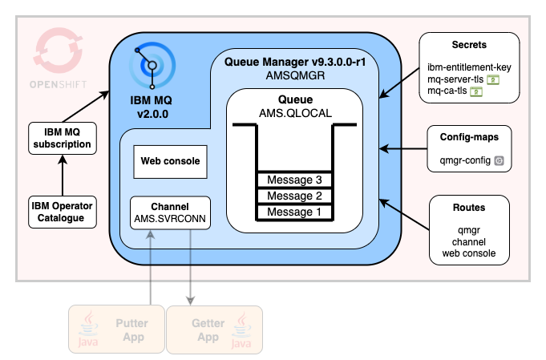

After running the scripts you will have the following MQ setup running on OpenShift:

- IBM MQ Operator v2.0.0
- `AMSQMGR` Queue Manager v9.3.0.0-r1
  - `AMS.QLOCAL` queue
  - `AMS.SVRCONN` channel
  - Web console enabled
  - Trust your JMS application (certificates)
  - Only allows Alice to write and encrypt messages (MQS key)
  - Only allows Bob to read and decrypt messages (MQS key)
  - Using LDAP for authentication:
    - `mqwrite` user (putter app) can:
      - Connect to the queue manager
      - Access the channel
      - Write to the queue (put messages)
    - `mqread` user (getter app) can:
      - Connect to the queue manager
      - Access the channel
      - Read from the queue (get messages)

### 5 - Setup the JMS apps
**Compile the JMS Putter and Getter applications.**

In order to build the JMS application that can send and receive encrypted messages from the queue, through authenticating as Alice or Bob, follow the steps below.

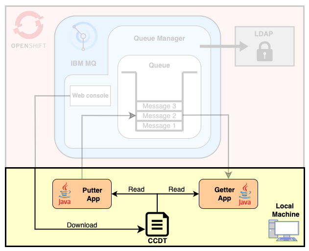

To start with, you will need to give all the information and credentials about your MQ instance to the apps. The simplest way to do so is to **download a CCDT file** locally from the MQ web console and make sure the apps are reading from it.

1. Login to the MQ web console using the following commands. Please be aware that the web console takes some time to become available after deploying the queue manager.
   - Get the url:
    ```sh
    oc get queuemanager ams-qmgr -n ams-mq -ojsonpath='{.status.adminUiUrl}'
    ```
   - If prompted, select **IBM provided credentials** 
   - Get the password for the `admin` username:
    ```sh
    oc -n ibm-common-services get secret platform-auth-idp-credentials -ojsonpath='{.data.admin_password}' | base64 --decode
    ```   

2.  From the homepage, go to **Download connection file** and select the following values:
    - **Queue Manager**: `AMSQMGR`
    - **Channel**: `AMS.SVRCONN`
    - **Cipher**: leave as default

    Leave the **Connections** tab as default and download the CCDT file locally.

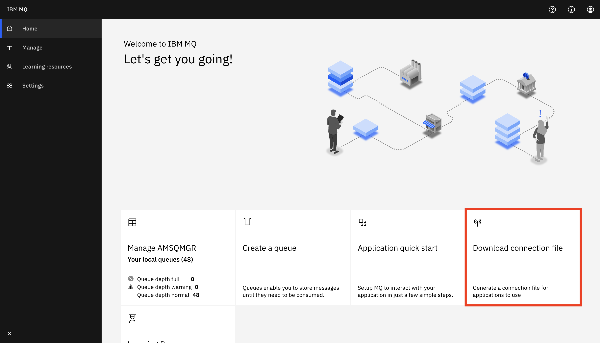

3. Update the path to your CCDT file in the [mq-config.properties](05-mq-jms-app/jms-app/src/main/resources/mq-config.properties) file.
```sh
# Absolute path to the CCDT file
ccdt_location = <local-path-to-ccdt-file>
```

4. To build the JMS client apps with Maven, run the [build.sh](05-mq-jms-app/build.sh) script.
```sh
./05-mq-jms-app/build.sh
```

### Run the JMS apps
**Send encrypted messages and receive decrypted messsages as authenticated users, using the JMS applications.**

1. Run the [runPut.sh](runPut.sh) script to authenticate as Alice and write encrypted messages to the queue. The script will:
   - Update the path stored in the `MQS_KEYSTORE_CONF` environment variable to refer to Alice MQS folder (`03-ams-keys/keys/alice/`)
   - Run the putter app locally. The app puts a message containing a timestamp in the queue every 2 seconds.
```sh
./runPut.sh
```

2. Run the [runGet.sh](runGet.sh) script to authenticate as Bob and read decrypted messages from the queue. The script will:
   - Update the path stored in the `MQS_KEYSTORE_CONF` environment variable to refer to Bob MQS folder (`03-ams-keys/keys/bob/`)
   - Run the Getter app locally. The app gets all the messages from the queue.

```sh
./runGet.sh
```
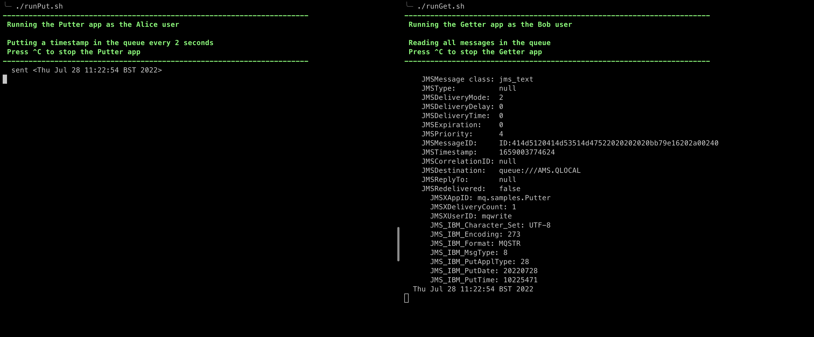

Since the messages are now encrypted, James the MQ Administrator will not be able to read them from the MQ Console or MQ CLI. He can see information about the queue such as the number of messages but not the messages themselves. You can check this feature by login in the MQ console (instructions listed in step 1).

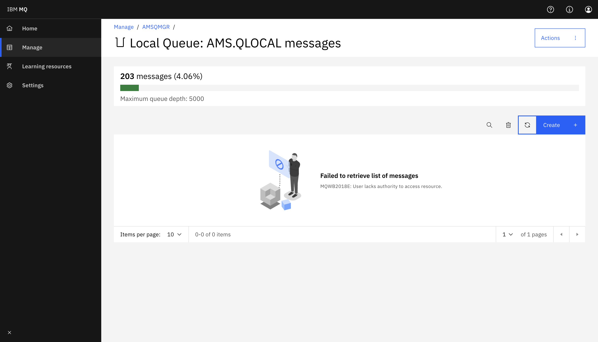
